# Awesome Continuous Delivery & Release Automation 🚀 🔄

  

  
  
  
  
  
  

---

## 🌟 Top Continuous Delivery & Release Automation Ecosystem

**Curated List of Commercial CI/CD SaaS Platforms, GitOps Deployment Engines & Open-Source Release Automation Frameworks**  

*Focused on Pipeline Automation, GitOps, Progressive Delivery, Release Orchestration, Artifact Management & Self-Hosted CI/CD Infrastructure* 🛠️ ⚡

**Last updated: October 2026** 📅

---

### 📌 Overview & SEO Summary

Welcome to the ultimate curated directory of **continuous delivery platforms**, **open-source release automation tools**, and **GitOps deployment frameworks**. Whether you are looking for enterprise-grade commercial solutions (such as *GitHub Actions*, *GitLab CI/CD*, and *Harness*), or self-hostable open-source alternatives (like *Argo CD*, *Jenkins*, *Drone*, and *Tekton*), this list covers category leaders, progressive delivery, cloud-native deployments, and release automation.

---

## 📑 Table of Contents

- [🏢 SaaS & Commercial Platforms](#-saas--commercial-platforms)
- [🔓 Open-Source GitHub Projects](#-open-source-github-projects)
- [🛠️ How to Contribute](#%EF%B8%8F-how-to-contribute)
- [📊 Star History](#-star-history)
- [🤝 Support & Sponsorship](#-support--sponsorship)
- [⚠️ Disclaimer](#%EF%B8%8F-disclaimer)

---

## 🏢 SaaS & Commercial Platforms

> 💡 **Market Size & Structure:** The Continuous Delivery & Release Automation market is estimated at **~$12.5 Billion in 2026** and is **moderately fragmented**, with hyperscaler cloud platforms (Microsoft/GitHub, AWS) dominating developer integration, while specialized GitOps and enterprise orchestrators (Harness, Octopus Deploy) command high-growth enterprise niches.

*Sorted by Company Valuation / Market Cap (Descending)* 📊

| SaaS / Commercial Platform | Company / Owner | Valuation / Market Cap | Standard Edition Starting Price | Free Tier / Free Trial Limits | Description |
| :--- | :--- | :--- | :--- | :--- | :--- |
| **[GitHub Actions](https://github.com/features/actions)** 🐙 | Microsoft / GitHub | ~$3.90 Trillion | **$4/user/month** (Team plan) | **Free unlimited for public repos**; **2,000 Linux mins/mo** & **500MB storage for private repos** | **GitHub-native CI/CD** — **20,000+ marketplace actions**. **Matrix builds, reusable workflows, and OIDC authentication**. **Self-hosted runners** for custom environments. |
| **[Azure Pipelines](https://azure.microsoft.com/en-us/products/devops/pipelines/)** 🔷 | Microsoft | ~$3.90 Trillion | **$6/user/month** (Basic plan) | **Free 1,800 build mins/mo** (1 free parallel job for private), **unlimited for public** | **Azure DevOps CI/CD** — **Build and release pipelines** with YAML or classic visual editor. **Self-hosted agents** for custom environments and deep Azure integration. |
| **[AWS CodePipeline](https://aws.amazon.com/codepipeline/)** ☁️ | Amazon | ~$2.0 Trillion | **$1.00/pipeline/month** | **Free tier includes 1 active pipeline/mo** + **100 build mins/mo on AWS CodeBuild** | **AWS-native CI/CD orchestration** — Continuous delivery service for fast and reliable application and infrastructure updates integrated with CodeBuild & CodeDeploy. |
| **[GitLab CI/CD](https://docs.gitlab.com/ee/ci/)** 🦊 | GitLab | ~$8.0 Billion | **$29/user/month** (Premium) | **Free: 400 CI/CD compute mins/mo** & **5 GB storage** | **All-in-one DevOps platform** — **CI/CD, source control, and deployment** in a single platform. **Auto DevOps** and **Review Apps** for ephemeral environments. |
| **[Harness CD](https://www.harness.io/)** 🚀 | Harness | ~$3.7 Billion | **$0.75/HSU/month** (Essentials) | **Free 1,000 HSUs/mo** for orgs with **<$250K cloud spend** | **AI-powered continuous delivery** — **Deploy any app to any cloud** with **built-in verification, automated rollbacks, and GitOps**. |
| **[TeamCity](https://www.jetbrains.com/teamcity/)** 🧠 | JetBrains | ~$1.5 Billion | **$299/year** (10 build agents) | **Free: 3 build agents** & **100 build configurations** (Self-hosted) or **14-day Cloud trial (12k credits)** | **Powerful enterprise CI/CD** — **Kotlin DSL for pipeline-as-code**. **Test intelligence and parallel builds**. |
| **[Octopus Deploy](https://octopus.com/)** 🐙 | Octopus Deploy | ~$1.2 Billion | **$10/target/month** (Cloud) | **Free Community edition** up to **10 deployment targets & 10 projects** | **Deployment orchestration and release management** — **Bi-directional Tentacle agent** for Linux/Windows with multi-tenancy and runbook automation. |
| **[CircleCI](https://circleci.com/)** ⚡ | CircleCI | ~$1.0 Billion | **$15/month** (Performance plan) | **Free 30,000 credits/mo** (up to **6,000 build mins/mo**) & **5 active users** | **Cloud-native CI/CD** — **Credit-based compute pricing**, **30 concurrent Docker jobs on free tier**, with macOS and GPU support. |
| **[Buildkite](https://buildkite.com/)** 🔵 | Buildkite | ~$200 Million | **$15/user/month** (Pro plan) | **Free up to 3 users** & **5 self-hosted agents** | **Hybrid CI/CD** — **Runs pipelines on your own infrastructure**. Scalable and secure — no source code leaves your private environment. |
| **[Spinnaker (Armory Platform)](https://spinnaker.io/)** 🏗️ | Armory / CloudDriver | ~$100 Million | **$1,500/month** (Managed Armory CD) | **14-day free trial** with up to **25 application targets & 1,000 deployments** | **Multi-cloud continuous delivery platform** — Automated canary analysis, blue/green deployments, and GitOps release workflows backed by Netflix & Google. |

---

## 🔓 Open-Source GitHub Projects

*Sorted by GitHub Stars_Count (Descending)* 🌟

- **[fastlane](https://github.com/fastlane/fastlane)**   
  **The easiest way to automate building and releasing iOS and Android apps**, MIT licensed. **Automates beta deployment, screenshot generation, code signing, and App Store / Google Play distribution**. 📱 🚀

- **[Drone](https://github.com/harness/drone)**   
  **Container-native Continuous Integration platform built on Docker**, Apache-2.0 licensed. **Lightweight YAML configuration**, isolated container steps, and seamless plugin architecture backed by Harness. 🛸 📦

- **[Jenkins](https://github.com/jenkinsci/jenkins)**   
  **The leading open source automation server**, MIT licensed. **1,800+ plugins** for build, test, deploy, and release automation with declarative/scripted pipelines. 🏛️ 🔧

- **[semantic-release](https://github.com/semantic-release/semantic-release)**   
  **Fully automated version management and package publishing**, MIT licensed. **Determines the next version number, generates release notes, and publishes the package** based on Semantic Commit messages. 🏷️ 📦

- **[Argo CD](https://github.com/argoproj/argo-cd)**   
  **Declarative, GitOps continuous delivery tool for Kubernetes**, Apache-2.0 licensed. **CNCF Graduated project**. Automatically syncs cluster state with Git repositories using Helm, Kustomize, or raw YAML. 🎯 ☸️

- **[Devtron](https://github.com/devtron-labs/devtron)**   
  **Kubernetes-native CI/CD and GitOps platform**, Apache-2.0 licensed. **Open-source Heroku-like dashboard experience** for Kubernetes deployment, monitoring, and security management. 🚀 🌐

- **[Dagger](https://github.com/dagger/dagger)**   
  **Programmable CI/CD engine with container-native pipelines**, Apache-2.0 licensed. **Write delivery pipelines in Go, Python, TypeScript, or GraphQL** and execute them locally or in any CI. 🗡️ 💻

- **[Capistrano](https://github.com/capistrano/capistrano)**   
  **A remote server automation and deployment tool**, MIT licensed. **Scriptable workflow tool for automated deployments** across web servers via SSH. 💎 📡

- **[Spinnaker](https://github.com/spinnaker/spinnaker)**   
  **Multi-cloud continuous delivery platform**, Apache-2.0 licensed. **Created by Netflix and Google**. Supports automated canary analysis, blue/green rollouts, and multi-region cloud pipelines. 🏗️ ☁️

- **[Flux CD](https://github.com/fluxcd/flux2)**   
  **Open and extensible continuous delivery solution for Kubernetes**, Apache-2.0 licensed. **CNCF Graduated GitOps toolkit**. Specialized controllers for Helm, Kustomize, and automated image updates. 🦊 ☸️

- **[GoCD](https://github.com/gocd/gocd)**   
  **Continuous delivery server built by ThoughtWorks**, Apache-2.0 licensed. **Value stream mapping, parallel execution, and complex dependency pipeline visualizer**. 🗺️ 🔄

- **[Concourse](https://github.com/concourse/concourse)**   
  **Container-based automation system**, Apache-2.0 licensed. Written in Go with an opinionated focus on idempotency, immutability, and declarative build resources. 🏭 📦

- **[release-it](https://github.com/release-it/release-it)**   
  **CLI tool to automate versioning and package publishing**, MIT licensed. Git tagging, release notes, GitHub/GitLab releases, and npm publishing in one command. 🚀 🏷️

- **[Woodpecker CI](https://github.com/woodpecker-ci/woodpecker)**   
  **Simple yet powerful community-driven CI/CD engine**, MIT licensed. Container-based pipelines using simple YAML configuration. 🪵 🐦

- **[Flagger](https://github.com/fluxcd/flagger)**   
  **Progressive delivery operator for Kubernetes**, Apache-2.0 licensed. Automates canary rollouts, A/B testing, and blue/green deployments using service meshes (Istio, Linkerd, Envoy). 🏁 🚦

- **[Jenkins X](https://github.com/jenkins-x/jx)**   
  **Cloud-native CI/CD for Kubernetes**, Apache-2.0 licensed. Automated CI/CD with Preview Environments on pull requests using Tekton and GitOps. ☁️ ⚓

- **[Tekton Pipelines](https://github.com/tektoncd/pipeline)**   
  **Kubernetes-native CI/CD resource framework**, Apache-2.0 licensed. CNCF Incubating project providing standardized custom resources (CRDs) for pipeline automation. 🔧 ☸️

- **[Keptn](https://github.com/keptn/keptn)**   
  **Cloud-native application lifecycle orchestration engine**, Apache-2.0 licensed. CNCF Incubating project automating continuous delivery, SLO-based quality gates, and automated remediation. 📈 🛡️

---

## 🛠️ How to Contribute

Contributions are welcome! Follow these steps to submit new CD platforms or open-source release automation software:

1. 🍴 **Fork** the repository.
2. 📝 **Add/edit** entries in `README.md` maintaining table/list structure and formatting.
3. 🔗 Include project title, official website/GitHub link, exact Stars_Count, license, and brief description.
4. 🚀 Submit a **Pull Request** with a descriptive summary of your changes.

Check out our curated list directory on [Awesome-Awesome-Awesome](https://github.com/ishandutta2007/wAwesome-Awesome-Awesome) for more dev resources! 🌐

---

## 📊 Star History

---

## 🤝 Support & Sponsorship

If you find this continuous delivery & release automation directory useful, please consider supporting the project:

- ⭐ **Star** this repository to increase visibility!
- 🔀 **Fork** and share with fellow DevOps engineers, platform teams, and open-source advocates.
- ☕ **Sponsor & Buy Me a Coffee**: Support ongoing open-source curation via the [GitHub Sponsor Dashboard](https://github.com/sponsors/ishandutta2007).

---

## ⚠️ Disclaimer

- This is a **community-curated** list — not exhaustive and not an endorsement. ℹ️
- **GitHub Actions and GitLab CI/CD provide generous free minutes** for public and private projects.
- **Argo CD and Flux CD are CNCF Graduated GitOps tools** — the de facto standards for Kubernetes deployment.
- **Always test and validate deployment pipelines in sandbox environments** before production deployment. 🚀

---

  <b>Made with ❤️ for DevOps engineers, platform teams, and open-source release automation advocates.</b>

